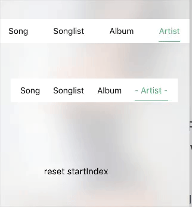

## Description

**Cocoapods**

```
Add pod 'ZFSegmentView', '~> 0.0.4' to Podfile.
```

## Requirements

- iOS 8.0+
- Swift 3.0+

## How To Use

**Step1**

```
let configs = [ZFSegmentConfig(
      normalAttributedText: NSMutableAttributedString(string: "Song", attributes: normalAttri),
      selectedAttributedText: NSMutableAttributedString(string: "Song", attributes: greenAttri),
      indicatorColor: indicatorColor,
      indicatorBottom: indicatorBottom,
      indicatorHeight: indicatorHeight),
                   ZFSegmentConfig(
                    normalAttributedText: NSMutableAttributedString(string: "Songlist", attributes: normalAttri),
                    selectedAttributedText: NSMutableAttributedString(string: "Songlist", attributes: greenAttri),
                    indicatorColor: indicatorColor,
                    indicatorBottom: indicatorBottom,
                    indicatorHeight: indicatorHeight)]
```

**Step2**

```
let segmentView = ZFSegmentView(frame: .zero,
                                        contentEdge: UIEdgeInsetsMake(0, 0, 0, 0), configs: configs, type: .center)
    segmentView.backgroundColor = UIColor.white
    segmentView.frame = CGRect(x: 20, y: 164, width: self.view.bounds.size.width - 40, height: 40)
    segmentView.animationDuration = 0.2
    segmentView.startIndex = 3
    segmentView.didSelectHandler = {
      (oldIndex, newIndex) in
      print("old == \(oldIndex)")
      if oldIndex != newIndex {
        print("new == \(newIndex)")
      }
    }
```

